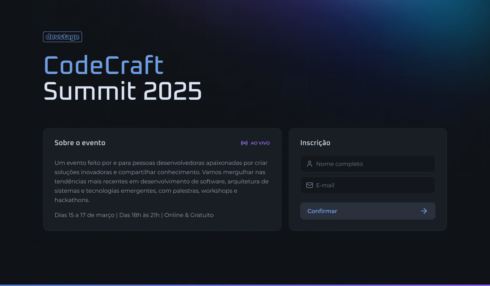
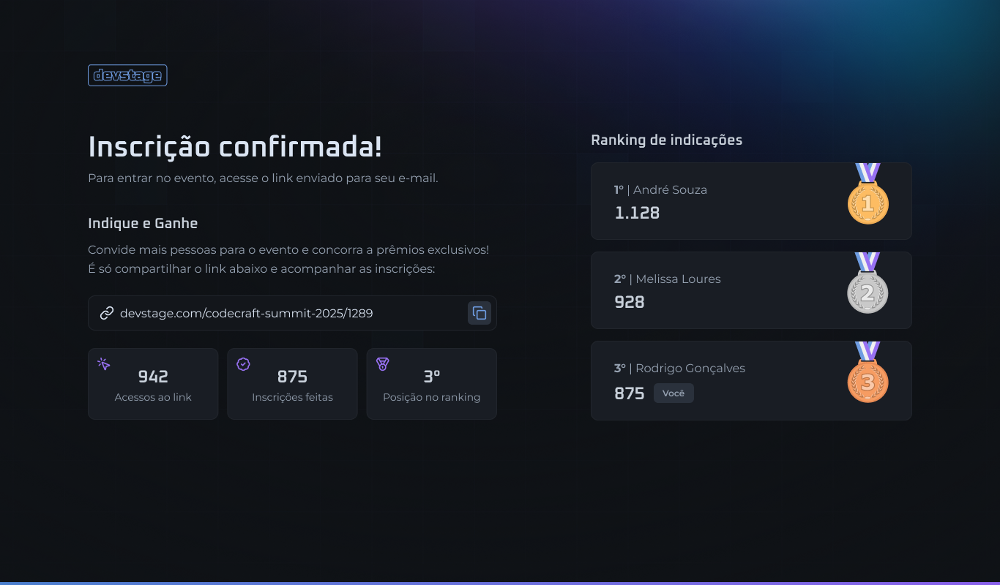

<div align="center">
<div>
 <br/><br/>

</div>
<br/>
<br/>
</div>
<div align="center">
   <a href="https://github.com/mathrb22">
      
   </a>
   <a href="https://github.com/mathrb22/nlw-devstage-web/commits/main">
      
   </a>
   <a href="https://github.com/mathrb22/nlw-devstage-web/issues">
      
   </a>
   <a href="https://github.com/mathrb22/nlw-devstage-web/pulls">
      
   </a>
   <a href="https://github.com/mathrb22/nlw-devstage-web/blob/main/LICENSE">
      
   </a>
</div>

</br>
<div align="center">

[**Sobre**](#-sobre) &nbsp;&nbsp;**|**&nbsp;&nbsp;
[**Objetivo**](#-objetivo) &nbsp;&nbsp;**|**&nbsp;&nbsp;
[**Tecnologias e ferramentas**](#-tecnologias-e-ferramentas) &nbsp;&nbsp;**|**&nbsp;&nbsp;
[**Features**](#-features) &nbsp;&nbsp;**|**&nbsp;&nbsp;
[**Protótipo**](#-protótipo) &nbsp;&nbsp;**|**&nbsp;&nbsp;
[**Instalação e execução**](#-instalação-e-execução) &nbsp;&nbsp;**|**&nbsp;&nbsp;
[**Como contribuir**](#-como-contribuir) &nbsp;&nbsp;**|**&nbsp;&nbsp;
[**Licença**](#-licença)

</div>

## 📃 Sobre



**Devstage** é o projeto desenvolvido durante a trilha de React da **Next Level Week Connect**, um evento online produzido pela [**Rocketseat**](https://github.com/Rocketseat).

Trata-se de uma aplicação web que permite aos usuários se inscreverem em um evento, e compartilhar um link de indicação para que outras pessoas se inscrevam no evento. A aplicação conta com um sistema de ranking, onde os usuários podem visualizar a posição deles no ranking, e também visualizar o ranking geral.



## 🎯 Objetivo

O objetivo principal do **Devstage** é proporcionar uma experiência de inscrição em eventos mais interativa e engajadora, permitindo que os usuários possam compartilhar um link de indicação para que outras pessoas se inscrevam no evento, e assim, possam subir no ranking.

A aplicação foi desenvolvida com o intuito de aprimorar os conhecimentos em React, Next.js (v15), TypeScript, Tailwind CSS (v4) e Zod, além de proporcionar uma experiência de aprendizado e networking com a comunidade de desenvolvedores.


## 🚀 Tecnologias e ferramentas

<table>
  <tr>
    <td align="center" width="100">
      <a href="https://reactjs.org/" target="_blank" rel="noopener noreferrer">
      
      </a>
    </td>
    <td align="center" width="100">
      <a href="https://nextjs.org/">
      
      </a>
    </td>
    <td align="center" width="100">
      <a href="https://www.typescriptlang.org/">
      
      </a>
    </td>
    <td align="center" width="120">
      <a href="https://tailwindcss.com" target="_blank" rel="noopener noreferrer">
      
      </a>
    </td>
    <td align="center" width="100">
      <a href="https://zod.dev/" target="_blank" rel="noopener noreferrer">
      
      </a>
    </td>
    <td align="center" width="140">
      <a href="https://www.react-hook-form.com/" target="_blank" rel="noopener noreferrer">
      
      </a>
    </td>
    </tr>
    <tr>
    <td align="center"><a href="https://reactjs.org/" target="_blank" rel="noopener noreferrer"><span>React</span></a></td>
    <td align="center"><a href="https://nextjs.org/" target="_blank" rel="noopener noreferrer"><span>Next.js</span></a></td>
    <td align="center"><a href="https://www.typescriptlang.org/" target="_blank" rel="noopener noreferrer"><span>TypeScript</span></a></td>
    <td align="center"><a href="https://tailwindcss.com" target="_blank" rel="noopener noreferrer"><span>Tailwind CSS</span></a></td>
    <td align="center"><a href="https://zod.dev/" target="_blank" rel="noopener noreferrer"><span>Zod</span></a></td>
    <td align="center"><a href="https://www.react-hook-form.com/" target="_blank" rel="noopener noreferrer"><span>React Hook Form</span></a></td>
    </tr>
</table>

## ✨ Features

✅ **Realização de inscrição:** permite a inscrição rápida no evento.<br/>
✅ **Cópia do link de indicação:** gera um link compartilhável para convidar participantes.<br/>
✅ **Visualização de acessos:** exibe a quantidade de vezes que o link foi acessado.<br/>
✅ **Acompanhamento de inscrições:** exibe quantas pessoas se inscreveram pelo link.<br/>
✅ **Ranking de indicação:** exibe a posição do usuário no ranking geral.<br/>


## 🎨 Protótipo

O protótipo do projeto foi desenvolvido utilizando a ferramenta [**Figma**](https://www.figma.com/). Você pode acessá-lo [aqui](https://www.figma.com/community/file/1471119935944492720/nlw-connect-devstage).


## 🔧 Instalação e execução

Para baixar o código-fonte do projeto em sua máquina, primeiramente terá que ter instalado o [**Git**](https://git-scm.com/).
Com o Git instalado, em seu terminal execute o seguinte comando:

```bash
git clone https://github.com/mathrb22/nlw-devstage-web.git
```

Para instalar as dependências e executar o projeto terá que ter instalado em sua máquina o [**node.js**](https://nodejs.org/en/), que vem acompanhado do npm. Instale as dependências usando o comando abaixo:

```bash
npm install
```

Executar o projeto:

```bash
npm run dev
```

A aplicação estará disponível em http://localhost:3000. Você poderá acessá-la a partir do seu navegador.

## 💡 Como contribuir

- Faça um **_fork_** desse repositório;
- Crie um **branch** para a sua feature: `git checkout -b minha-feature`;
- Faça um **commit** com suas alterações: `git commit -m 'feat: Minha nova feature'`;
- Faça um **push** para o seu branch: `git push origin minha-feature`;
- Faça um **pull request** com sua feature;

Pull requests são sempre bem-vindos. Em caso de dúvidas ou sugestões, crie uma _**issue**_ ou entre em contato comigo.

## 📝 Licença

<a href="https://github.com/mathrb22/nlw-devstage-web/blob/main/LICENSE">
    
</a>

Esse projeto está sob a licença **MIT**. Veja o arquivo _**LICENSE**_ para mais detalhes.

---

Desenvolvido com 💚 por <a href="https://github.com/mathrb22/">mathrb22</a>

<div style="display: flex;">
  <a href="https://www.linkedin.com/in/matheus-ribeiro-dev" target="_blank"></a>
  <a href="mailto:math.ribeiro.dev@gmail.com"></a>
</div>
